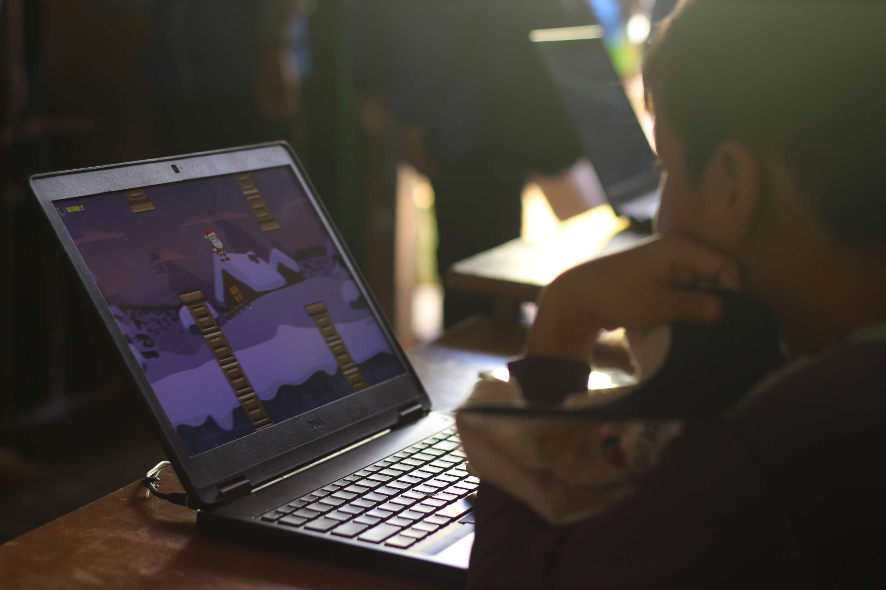

<html>
<h1> CHUYẾN XE CÔNG NGHỆ </h1>
     <em> <title>Chuyến xe công nghệ - Nhóm CoVy - SS004.K21.CLC</title> </em>
     
  

<h2> NỘI DUNG THỰC HIỆN DỰ ÁN </h2>
<body>
     
 Đem các máy móc công nghệ mới đến cho các em nhỏ ở vùng xa chưa được tiếp xúc nhiều với công nghệ, giúp các em phát triển hơn, có thể hòa nhập với sự phát triển của thời đại công nghệ hiện nay. 

</body>
<h2> THỜI GIAN, TIÊN ĐỘ THỰC HIỆN DỰ ÁN </h2>
     <body>
     
..................

     </body>
<h2> KẾ HOẠCH TÀI CHÍNH </h2>
     <body>
     <h3> Nguồn thu: </h3>
     
 Áo cho các bạn tình nguyện viên: 120.000đ/ 1 áo (Nếu chi phí còn dư sau dự án thì sẽ có thể dùng áo làm quà tặng các bạn tình nguyện viên) 

     
 Nguồn vốn kêu gọi từ các nhà đầu tư về máy móc và phương tiện đi lại 

     
 Các máy móc mua về sau đó sẽ có thể bán lại 

     <h3> Nguồn chi: </h3>
     
 Chi phí sinh hoạt trong 3 ngày: 2.500.000đ 

     
 Tiền thuê xe bus: Tùy vào địa điểm xa hay gần (Nếu không kêu gọi được nguồn vốn đầu tư) 

     
 Tiền quà tặng các cộng tác viên 

     
 Chi phí trong việc gọi vốn và tuyển cộng tác viên 

     
 Chi phí sửa chửa máy móc (nếu máy móc bị hỏng) 

     
..................

     </body>
<h2> KẾ HOẠCH MARKETING </h2>
     <body>
     
..................

     </body>
</html>
    
