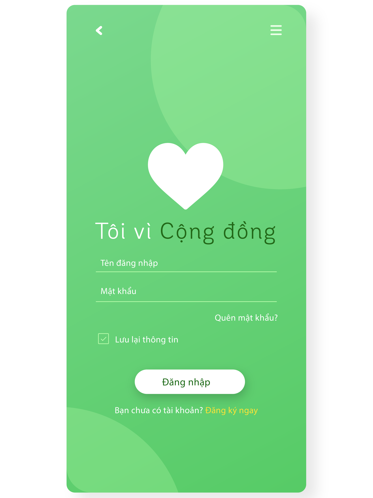
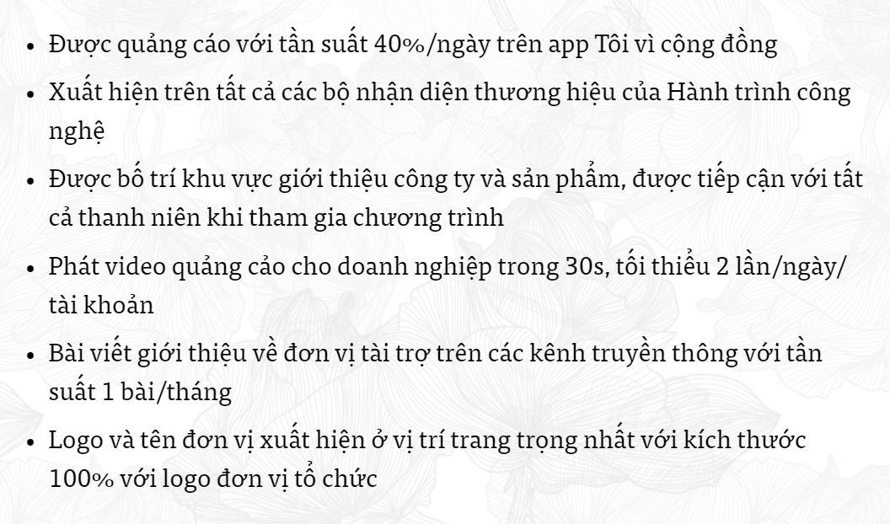
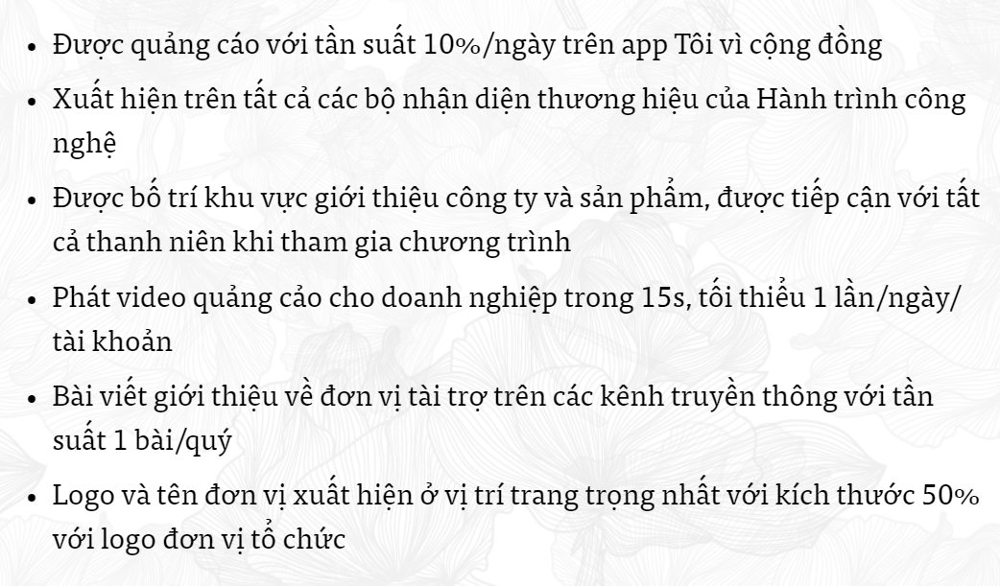
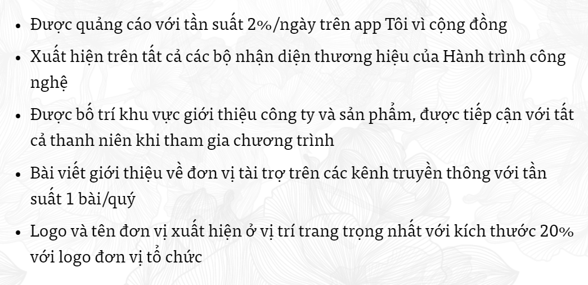

<html>

     <em> App Tôi vì cộng đồng - Nhóm Covy - SS004.K21.CLC</em>
     
  

     
  

<h2> THỜI GIAN, TIẾN ĐỘ THỰC HIỆN DỰ ÁN </h2>
     <body>
         
  

         
  

         
  

         
  

     </body>
<h2> KẾ HOẠCH TÀI CHÍNH CHO MỘT CHƯƠNG TRÌNH CỦA DỰ ÁN </h2>
     <body>
  
 <strong> Giai đoạn 1: 50.000.000đ </strong> 

  
 <strong> Giai đoạn 2: 200.000.000đ </strong> 

  
 <strong> Giai đoạn 3: 500.000.000đ </strong> 

  
 <strong> Giai đoạn 4: 2.000.000.000đ </strong> 

  <h3> Nhà tài trợ vàng </h3>
  
  

  <h3> Nhà tài trợ bạc: </h3>
  
  

  <h3> Nhà tài trợ đồng </h3>
   
  

     </body>
</html>
    
