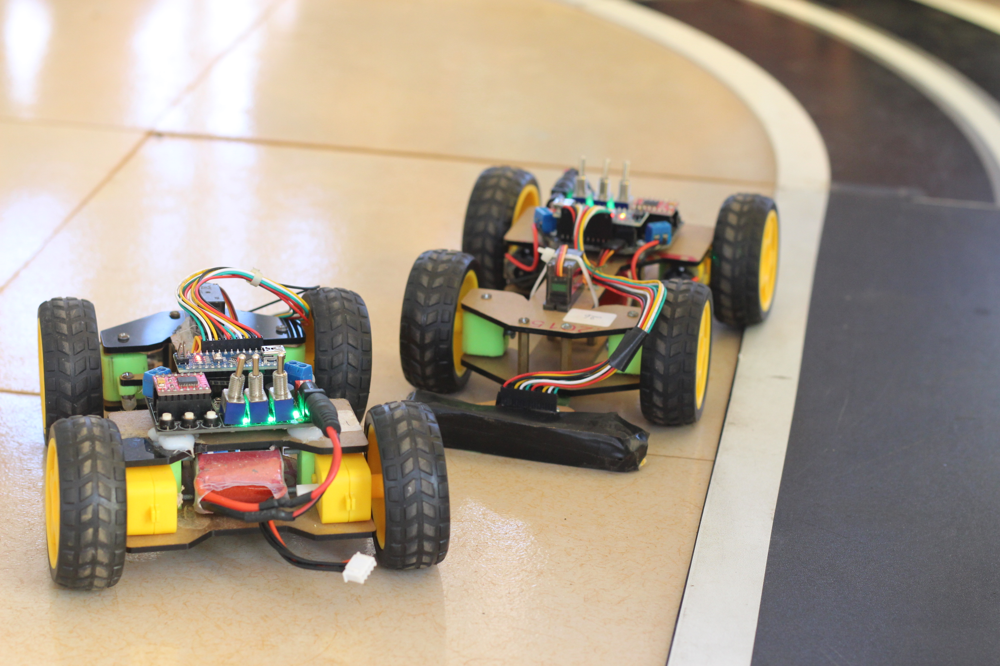
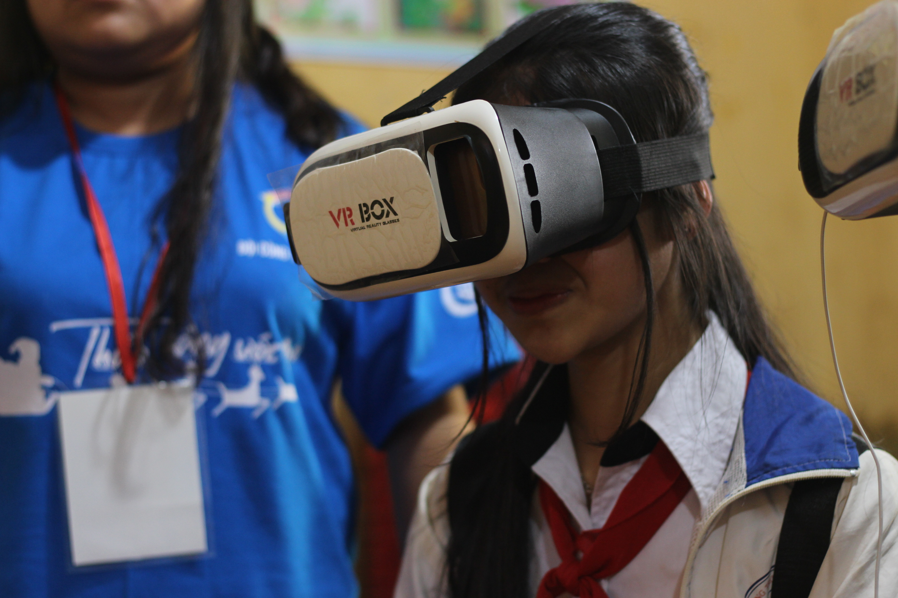
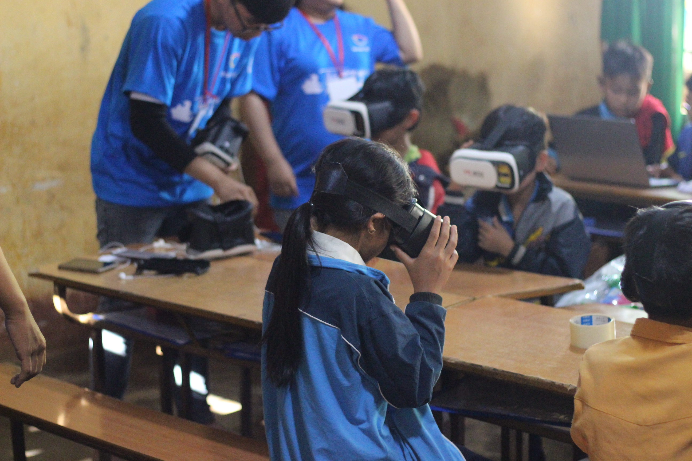
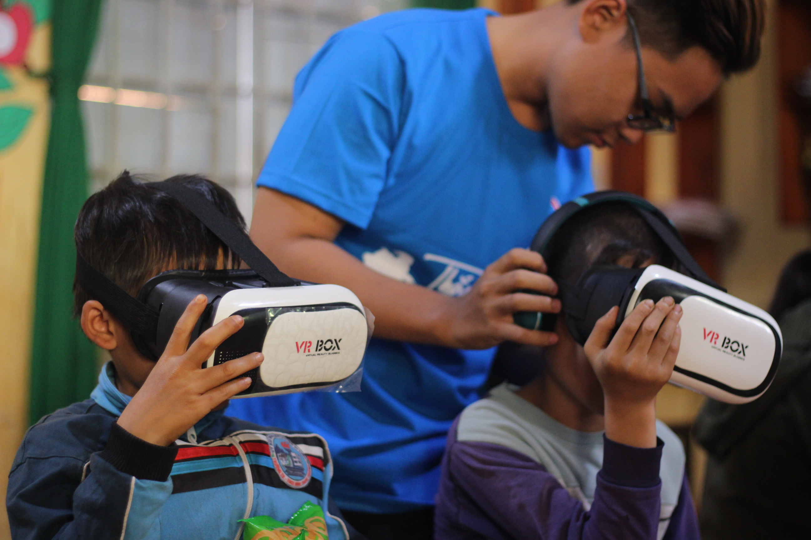

<html>

     <em> Chuyến xe công nghệ - Nhóm Covy - SS004.K21.CLC</em>
     
 
      

<h2> THỜI GIAN, TIẾN ĐỘ THỰC HIỆN DỰ ÁN </h2>
     <body>
          <ul>
               
 <strong><em>Giai đoạn 1:</em></strong> Lập trang web, page Facebook, đăng bài giới thiệu về dự án (dự án làm về vấn đề gì, đi đến đâu, đang cần gì, giới thiệu trụ sở) trên trang Facebook, kênh Youtube. 

               
 <strong><em>Giai đoạn 2:</em></strong> Mua các trang thiết bị công nghệ cho dự án như ipad, laptop, máy ảnh, kính VR và kêu gọi vốn tài trợ từ một số nguồn trong và ngoài trường. 

               
   

               
 <strong><em>Giai đoạn 3:</em></strong> Liên hệ trường để xin phép thực hiện dự án.

               
 <strong><em>Giai đoạn 4:</em></strong> Liên hệ với các đơn vị trường lớp hoặc địa phương nơi mà chúng ta muốn mang dự án “Chuyến xe công nghệ” đến với các em nhỏ.

               
 <strong><em>Giai đoạn 5:</em></strong> Thực hiện dự án 

          </ul>
          <h4> <strong> Dự án được thực hiện cụ thể như sau: </strong> </h4>
          
 <em>Nội dung hoạt động của dự án: </em> 

          <ul>
               
<li>Đối với các trường học ở vùng khó khăn: đem các máy móc công nghệ mới đến cho các em nhỏ ở vùng xa chưa được tiếp xúc nhiều với công nghệ, giúp các em phát triển hơn, có thể hòa nhập với sự phát triển của thời đại công nghệ hiện nay.</li>

               
<li>Đối với trường học đề nghị đến xây dựng tủ sách online: chia sẻ giao lưu, trao đổi với các em.</li> 

          </ul>
          
 <em>Địa điểm: </em>Các nơi vùng xa chưa được tiếp xúc với công nghệ mới và hiện đại hoặc những nơi có nhu cầu tìm hiểu về máy móc thông minh.

               
1. Tuyển tình nguyện viên phạm vi là sinh viên của trường (trong vòng 1 tuần):
                   <ul>
                         
 <li> Tạo form đăng ký cho Tình nguyện viên, ghi rõ thời gian địa điểm phỏng vấn. </li> 

                         
 <li> Hình thức: đăng ký online trên Page Facebook dự án và đăng ký trực tiếp tại trụ sở tại trường Đại học Công nghệ thông tin. </li> 

                         
 <li> Đăng bài tuyển Tình nguyện viên cho chương trình trên trang Facebook của dự án. </li> 

                         
 <li> Đối tượng: tất cả mọi người nhưng chủ yếu là sinh viên. </li> 

                         
 <li> Mở cuộc phỏng vấn, sau phỏng vấn giữ lại 10 bạn.</li> 

                    </ul>
               

               
2. Sau khi tuyển Tình Nguyện Viên, các bạn Tình Nguyện Viên sẽ giúp chia sẻ dự án rộng hơn xa hơn, nhiều người biết đến dự án cũng như nhà tài trợ cho dự án. 

               
3. Di chuyển đến địa điểm thực hiện dự án bằng xe bus riêng.

               
4. Tổ chúc buổi giới thiệu các loại công nghệ tại các trường học cho các em nhỏ ở địa phương đã đến và cho các em trải nghiệm thử. Đối với những vùng đặc biệt khó khăn có thể tặng một số trang thiết bị mới cho các em.
   
                
 
                

     </body>
<h2> KẾ HOẠCH TÀI CHÍNH CHO MỘT CHƯƠNG TRÌNH CỦA DỰ ÁN </h2>
     <body>
     
 <strong><em> Nguồn vốn: </em></strong> 

     <ol>
          <li> Nguồn vốn được gọi từ các nhà tài trợ về máy móc và phương tiện đi lại. </li>
          <li> Các máy móc nếu mua về sau đó có thể bán lại. </li>
     </ol>
     
 <strong><em> Nguồn chi: </em></strong> 

     <table>
  <tr>
    <th>Việc chi tiêu cho dự án</th>
    <th>Số lượng</th>
    <th>Số tiền</th>
  </tr>
  <tr>
    <td>Thuê xe 16 chỗ</td>
    <td>1 chiếc (1 ngày)</td>
    <td>3.100.000đ</td>
  </tr>
  <tr>
    <td>Thức ăn, nước uống</td>
    <td>2 bữa</td>
    <td>450.000đ</td>
  </tr>
  <tr>
    <td>Dự trù sữa chữa máy móc và chi phí phát sinh</td>
    <td> </td>
    <td>5.000.000đ</td>
  </tr>
</table> 
     
 <strong><em> Tổng cộng: 8.550.000đ </em></strong> 

      <table>
  <tr>
    <th>Việc chi tiêu cho công tác tình nguyện</th>
    <th>Số lượng</th>
    <th>Số tiền</th>
  </tr>
  <tr>
    <td>Thuê xe 16 chỗ</td>
    <td>1 chiếc (3 ngày)</td>
    <td>9.300.000đ</td>
  </tr>
  <tr>
    <td>Thức ăn, nước uống</td>
    <td>9 bữa</td>
    <td>2.025.000đ</td>
  </tr>
  <tr>
    <td>Quà tặng khuyến khích các em học sinh học tốt</td>
    <td>30 phần</td>
    <td>15.000.000đ</td>
  </tr>
  <tr>
    <td>Ipad (thiết kế tủ sách điện tử)</td>
    <td>5 thiết bị</td>
    <td>20.000.000đ</td>
  </tr>
  <tr>
    <td>Dự trù sữa chữa máy móc và chi phí phát sinh</td>
    <td> </td>
    <td>5.000.000đ</td>
  </tr>
</table>
     
 <strong><em>  Tổng cộng: 51.325.000đ </em></strong> 
 
    
 <strong><em> Lợi nhuận: </em></strong> 

    <ul>
         
 <li> Lợi nhuận thu được từ việc thiết kế và lắp đặt tủ sách điện tử. </li> 

         
 <li> Tạo hiệu ứng truyền thông báo chí cho dự án và nhà đầu tư. </li> 

     </ul>
    
 
                

     </body>
<h2> KẾ HOẠCH MARKETING </h2>
     <body>
     <ul>
          
 <li> Tạo trang web, Facebook giới thiệu dự án kêu gọi nhà tài trợ, nhà hảo tâm. </li> 

          
 <li> Mở một trang Youtube làm vlog về những chuyến hành trình để truyền thông. ̣ </li> 

          
 <li> Kêu gọi sự ủng hộ các công ty buôn bán máy tính nhỏ lẻ đổi lại có thể PR cho các khu vực buôn bán nhỏ lẻ đó thông qua các hình thức như là FB và được thông báo là 1 trong nhà tài trợ. </li> 

          
 <li> Dán thương hiệu nhà tài trợ và chủ đề dự án của mình lên chiếc xe thực hiện dự án. </li> 

          
 <li> Hợp tác tổ chức cuộc thi cùng nhà tài trợ vừa để quảng bá cho nhà tài trợ vừa được tài trợ khoản chi phí góp vào quỹ giúp trẻ em nghèo vùng sâu vùng xa. </li> 

     </ul>
     </body>
</html>
    
