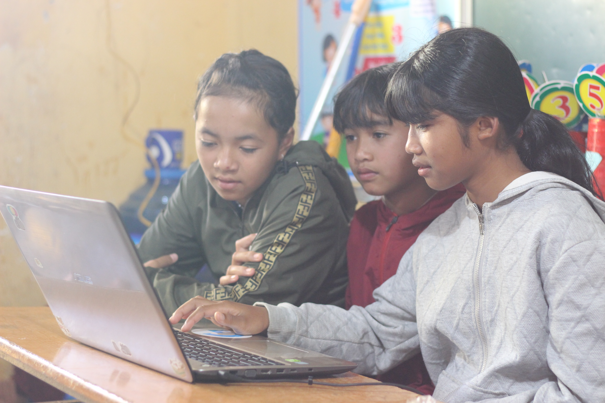

<html>

     <em> App Tôi vì cộng đồng - Nhóm Covy - SS004.K21.CLC</em>
     
  

<h2> MỤC ĐÍCH THỰC HIỆN DỰ ÁN </h2>

 Nâng cao nhận thức của những bậc phụ huynh, trẻ em ở những vùng Tây Nguyên - nơi vẫn còn nhận thức chưa cao về việc học tập để cải thiện cuộc sống. 

 Đem những món quà công nghệ đến với những hoàn cảnh còn khó khăn, thiếu thốn 

  

  

<h2> ĐỐI TƯỢNG MÀ DỰ ÁN MUỐN HƯỚNG ĐẾN </h2>
<h4> <em> Đối tượng là sinh viên: </em> </h4>
  
 Góp phần thúc đẩy sinh viên hăng hái hơn trong các hoạt động tình nguyện, xã hội. 

  
 Liên kết với nhà trường để tích lũy "Điểm rèn luyện" cho sinh viên đơn giản, tiện lợi hơn 

  
  

  
 Ứng dụng có hai chương trình song song để đối tượng sinh viên tham gia: 

  <ul>
    <li> Chương trình phụ: Mỗi tháng thay đổi 1 lần với các hoạt động tình nguyện để gây quỹ như: Chạy bộ, Ngày hội No Plastic,.. </li>
    <li> Chương trình chính: Đăng ký tham gia làm Cộng tác viên với chương trình Tôi vì cộng đồng </li>
  </ul>
  
  

<h4> <em> Đối tượng là doanh nghiệp: </em> </h4>
  
 Kêu gọi nguồn đầu tư từ các doanh nghiệp. 

  
 Tuyên truyền, quảng bá giúp các doanh nghiệp đã góp phần ủng hộ chương trình. 

   
  
 
<h2> THỜI GIAN, TIẾN ĐỘ THỰC HIỆN DỰ ÁN </h2>
     <body>
  
 <strong> Kế hoạch thực hiện dự án: </strong> 

         
  

         
  

     </body>
<h2> KẾ HOẠCH TÀI CHÍNH CHO MỘT CHƯƠNG TRÌNH CỦA DỰ ÁN </h2>
     <body>
  
 <strong> Giai đoạn 1: 50.000.000đ </strong> 

  
 <strong> Giai đoạn 2: 200.000.000đ </strong> 

  
 <strong> Giai đoạn 3: 500.000.000đ </strong> 

  
 <strong> Giai đoạn 4: 2.000.000.000đ </strong> 

  
 <em> (Sau mỗi giai đoạn sẽ kêu gọi tái đầu tư) </em> 

  <h3> Các nhà tài trợ cho chương trình sẽ có những lợi ích tương ứng </h3>
  <h4> Nhà tài trợ vàng </h4>
  
  

  <h4> Nhà tài trợ bạc: </h4>
  
  

  <h4> Nhà tài trợ đồng </h4>
   
  

     </body>
</html>
    
